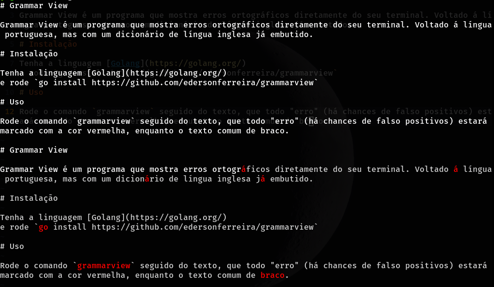

# Grammar View

Grammar View é um programa que mostra erros ortográficos diretamente do seu terminal. Voltado á língua portuguesa, mas com um dicionário de língua inglesa já embutido.

# Instalação

Tenha a linguagem [Golang](https://golang.org/)
e rode `go install github.com/edersonferreira/grammarview`

# Uso

Rode o comando `grammarview` seguido do texto, que todo "erro" (há chances de falso positivos) estará marcado com a cor vermelha, enquanto o texto comum de braço.

